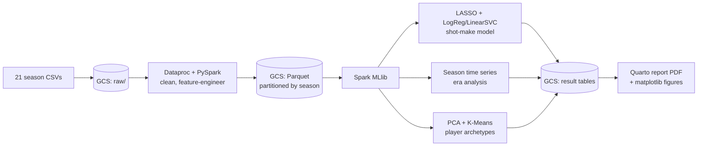

# court-vision — The Three-Point Revolution, Quantified

**A distributed-computing analysis of 4.2 million NBA shots (2004–2024) that quantifies why the three-point shift was mathematically inevitable, when it accelerated, and how it reorganized the league's player roles.**

> **Core question:** The NBA underwent a three-point revolution — but was it inevitable, when exactly did it tip, and what did it do to the kinds of players who succeed? This project answers all three with one coherent dataset and three connected analyses.

## Key findings

- **The mid-range is mathematically dominated.** Mid-range shots and above-the-break threes convert at nearly identical rates (39.9% vs. 35.1% FG), but the three generates **32% more points per attempt** (1.054 vs. 0.798). The corner three is the second-most-efficient shot in basketball, behind only the rim.
- **Location beats context.** A LASSO-selected shot-make classifier (ROC-AUC 0.63) shows shot location and action type carry the predictive weight, while game-context features (clutch, quarter, clock) are driven to zero.
- **The league tipped in 2015–2017.** Three-point attempt rate sat flat near 22% for half a decade, then accelerated sharply from 26.7% (2015) to 31.4% (2017), plateauing near 40% — the rate **more than doubled** over the panel (18.6% → 39.4%).
- **Player roles reorganized around the arc.** Clustering player-season shot profiles into five archetypes shows the mid-range specialist **collapsed from 37.3% to 7.7%** of qualifying player-seasons after 2015, while a modern balanced-scoring archetype **grew from 8.1% to 35.8%**.

## Architecture



Heavy compute runs on the cluster; the report is a thin presentation layer over small saved result tables — compute and presentation cleanly separated.

## Tech stack

| Layer | Tools |
|---|---|
| Cloud / compute | Google Cloud Storage, Dataproc (managed Spark), single-node `e2-highmem-4` |
| Processing | PySpark (Spark SQL + DataFrames), Parquet (partitioned by season) |
| Machine learning | Spark MLlib — LASSO, LogisticRegression, LinearSVC, PCA, K-Means |
| Reporting | Quarto (PDF), matplotlib |
| Tooling | Python, Git/GitHub, `gcloud` CLI, VSCode |

## How to run

The full pipeline runs as PySpark jobs submitted to Dataproc. Datasets (~2–3 GB) live in GCS, not in the repo.

```bash
# 1. start the cluster
gcloud dataproc clusters start mycluster

# 2. submit jobs in order (ingest -> process -> model)
gcloud dataproc jobs submit pyspark 02_processing/process_shots.py --cluster=mycluster
gcloud dataproc jobs submit pyspark 03_shot_model/shot_model.py \
    --cluster=mycluster --py-files=03_shot_model/feature_engineering.py
gcloud dataproc jobs submit pyspark 05_clustering/archetypes.py \
    --cluster=mycluster --py-files=05_clustering/player_features.py

# 3. stop the cluster (it bills while running)
gcloud dataproc clusters stop mycluster

# 4. render the report locally
quarto render report/report.qmd
```

## Repo structure

```
court-vision/
├── 01_ingestion/      # download + GCS upload + verification
├── 02_processing/     # PySpark cleaning + feature engineering -> Parquet
├── 03_shot_model/     # LASSO feature selection + classification
├── 04_era_analysis/   # 3-point-rate time series + figure
├── 05_clustering/     # PCA + K-Means player archetypes + figures
├── report/            # Quarto report (.qmd -> PDF) + figures
├── data/README.md     # schema of every processed column (no data files)
├── DECISIONS.md       # every non-obvious decision, with rationale
└── results/key_findings.md
```

## Limitations

The dataset has no defender or contest information, so the shot-make model measures the value of shot *location*, not shot *quality* under pressure — hence the honest, modest AUC. Cross-era comparisons are confounded by rule changes (2004–05 hand-check tightening) and shortened seasons (2012 lockout, 2020 bubble). The era split at 2015 is a chosen inflection point, not a discontinuity.

## AI-use note

AI assistance (Anthropic's Claude) was used for project planning, drafting and documenting the analysis scripts, explaining methods, and assembling this report; all analytical decisions, interpretation, and writing were reviewed and authored by the project owner. See the report's AI-Use Statement for specifics.