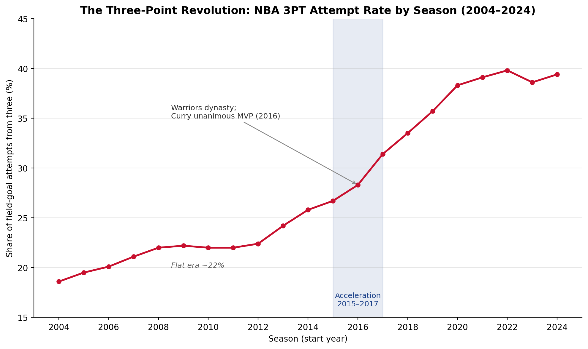

```{python}
# Shared setup — runs silently before any section
import pandas as pd
from IPython.display import Markdown
import warnings
warnings.filterwarnings("ignore")
```

# Introduction

<!-- WRITE: Open with the central puzzle — for most of NBA history the mid-range jump shot
was a core weapon, yet by the 2010s the league largely abandoned it. State the core question:
how did the three-point revolution reshape the NBA — why it made sense mathematically, when
it happened, and what it did to the kinds of players who succeed. The introduction should move
from the broad cultural moment (analytics revolution, pace-and-space) to the three specific
analytical questions this paper answers. End with a one-paragraph roadmap of the paper's
sections. Do NOT copy or paraphrase the abstract. -->

<!-- WRITE: Close the introduction with an explicit statement of the paper's three-part
analytical argument (the "through-line"): the mid-range penalty was always there in the math;
the Warriors proved you could build a title team around exploiting it; the league copied them,
and the player archetypes that define success changed as a result. Make clear which section of
the paper addresses each link in this chain. -->

# Data

## Source and Coverage

The primary dataset is NBA shot-location records for all 21 seasons from 2003–04 through
2024–25 (referred to throughout by the calendar year the season began, e.g., "2004" for
2003–04). Data were sourced from the publicly available NBA_Shots_04_25 repository
(Samangy, 2025), which aggregates shot-level records from the official NBA Stats API
(stats.nba.com). The raw dataset comprises 4,231,262 shot attempts across 26 columns,
including court coordinates (`LOC_X`, `LOC_Y`), shot distance, zone classification
(`BASIC_ZONE`), action type, shot type (2PT or 3PT), game context fields (quarter, minutes
and seconds remaining), player and team identifiers, and a make/miss indicator.

Raw CSV files were uploaded to Google Cloud Storage (bucket: `pstat135-adam`) and ingested
using Apache Spark on a Google Cloud Dataproc cluster (single-node `e2-highmem-4`,
`us-central1`, Dataproc image 2.2-debian12). Spark's schema inference confirmed the
26-column structure and zero null values across all fields.

## Cleaning and Feature Engineering

Data preparation removed 8,820 backcourt shots (desperation heaves recorded with
`ZONE_RANGE = "Back Court Shot"`) that do not represent genuine shooting decisions, yielding
**4,222,442 analysis-ready records**. Seven feature columns were added: `SECS_REMAINING`
(clock context as a single integer), `IS_3PT` and `SHOT_VALUE` (two/three-point indicators),
`IS_CLUTCH` (fourth quarter or overtime with ≤120 seconds remaining), `SHOT_MADE_INT`
(integer cast of the boolean target, required for Spark MLlib), `GAME_DATE_PARSED`, and
`EXPECTED_PTS` (`SHOT_VALUE × SHOT_MADE_INT`). The `ACTION_TYPE` field, which carries
dozens of raw values, was consolidated into five broad buckets (Dunk, Layup, Hook,
Jump Shot, Other) via keyword matching to prevent sparse one-hot expansion in model
training; the residual "Other" category accounts for approximately 1.4% of shots.

The cleaned dataset was written to GCS as Parquet, partitioned by season (`SEASON_1`),
enabling efficient season-level filtering in downstream analyses.

## Distributed Processing Justification

A single season's records fit comfortably on a laptop. The justification for Spark lies in
the scope of the analyses performed here: zone efficiency aggregations over all 4.2 million
shots, a 21-season time-series, a binary classifier trained on the full record pool, and
PCA plus K-Means over all qualifying player-seasons. Spark's lazy evaluation model allows
these operations to be expressed as logical plans and executed in a single distributed pass,
which is the appropriate tool for cross-era analyses that must treat all seasons as one
coherent dataset.

## Known Limitations

Three data limitations are relevant to interpretation. First, the dataset contains no
defender or contest information; the shot-make model therefore measures the value of shot
*location and action type*, not the quality of shot selection under defensive pressure.
Second, the 2012 season was shortened by a labor lockout to 66 games (versus the standard
82), and the 2020 season was shortened and played in a bubble environment; both seasons
show lower total attempt counts in @tbl-era and should not be interpreted as trend
deviations. Third, cross-era rule changes — most notably the 2004–05 defensive hand-check
rule tightening — may affect FG% comparisons between early and late seasons in this panel.

# Methodology

## Zone Efficiency

Zone efficiency was computed by grouping all shots by `BASIC_ZONE` and calculating
attempt count, field-goal percentage (FG%), and points per attempt (pts/attempt =
FG% × SHOT_VALUE). Points per attempt is the theoretically correct efficiency metric
because it accounts for the value differential between two- and three-point shots,
enabling a fair comparison: a 33.3% three-point shooter and a 50% two-point shooter
are equally efficient at 1.0 pts/attempt. Six zones are present after backcourt
removal: Restricted Area, In The Paint (Non-RA), Mid-Range, Left Corner 3, Right
Corner 3, and Above the Break 3.

## Era Analysis

Three-point attempt rate (3PT attempts / total attempts × 100) and overall FG% were
aggregated by season across all 21 seasons. The resulting time series (@tbl-era and
@fig-era) spans the pre-analytics era through peak three-point adoption, capturing
the full arc from 2004 to 2024.

## Shot-Make Model

A binary classification model predicts whether a given shot is made (`SHOT_MADE_INT = 1`).
Three columns were excluded from the feature vector as leakage: `EXPECTED_PTS`
(equals zero exactly when a shot is missed), `EVENT_TYPE` ("Made Shot"/"Missed Shot"),
and `SHOT_MADE` (the boolean target itself).

The **feature vector** (26 dimensions) comprises eight numeric features — `LOC_X`,
`LOC_Y`, `SHOT_DISTANCE`, `SECS_REMAINING`, `IS_3PT`, `SHOT_VALUE`, `IS_CLUTCH`,
`QUARTER` — and four categorical features encoded via `StringIndexer` +
`OneHotEncoder`: `BASIC_ZONE`, `SHOT_TYPE`, `ZONE_RANGE`, and `ACTION_GROUP`.
All transformers were fit on the 80% training split and applied to the held-out
20% test split (random seed 42) to prevent information leakage. `StringIndexer`
used `handleInvalid="keep"` so categories appearing only in the test set are assigned
a reserved bucket rather than crashing the job.

**LASSO regularization path.** Feature importance was assessed by sweeping
`regParam` over [0.05, 0.01, 0.005, 0.001, 0.0005, 0.0001] with
`elasticNetParam = 1.0` (pure L1 penalty), yielding active feature counts of
3 → 5 → 9 → 16 → 21 → 26 as the penalty relaxes. The order in which features
re-enter the model as regularization loosens provides a collinearity-robust
importance ranking. Headline coefficients are reported at `regParam = 0.001`
(16 of 26 features active), chosen as the penalty that preserves the zone
structure without selecting all features back in.

**Classifiers.** `LogisticRegression` (L2, `regParam = 0.01`) and `LinearSVC`
(`regParam = 0.01`) were trained on the same feature vector and evaluated on the
held-out test split using ROC-AUC and macro-F1. All analyses used the full dataset
(`SAMPLE_FRACTION = None`), encompassing all 4,222,442 records.

## Player Archetypes

Player archetypes were identified by clustering player-season shot profiles. Each
qualifying player-season was represented as a six-dimensional vector of zone shot
shares (rim, paint, mid-range, left corner 3, right corner 3, above-the-break 3),
which sum to one by construction. This compositional structure introduces a redundant
direction (one share is determined by the other five), motivating PCA before clustering.

The pipeline applied: (1) **StandardScaler** (zero mean, unit variance per dimension,
to prevent high-variance zones from dominating PCA); (2) **PCA** retaining 5 of 6
components (the sixth captures the near-zero compositional redundancy and is dropped);
(3) **K-Means** at $k = 5$ (random seed 42), chosen based on silhouette score and
interpretability of the resulting profiles. Era stability was assessed by holding
cluster assignments fixed and comparing the share of player-seasons in each archetype
for seasons before 2015 (`SEASON_1` < 2015) versus 2015 and after (`SEASON_1` ≥ 2015),
with 2015 chosen as the inflection point identified in the era analysis (Section 4.2).

# Results

## Zone Efficiency: The Mid-Range Penalty {#sec-zone}

@tbl-zone reports field-goal percentage and points per attempt for each of the six
shot zones across all 4,222,442 shots in the dataset.

```{python}
#| label: tbl-zone
#| tbl-cap: "Zone efficiency across 4,222,442 shots (2004–2024). Points per attempt is field-goal percentage multiplied by shot value (2 or 3), the appropriate cross-zone efficiency metric. Zones are sorted by descending efficiency."

df = pd.read_csv("tables/fg_pct_by_zone.csv")
df.columns = ["Zone", "Attempts", "FG%", "Pts/Attempt"]
df["Attempts"] = df["Attempts"].apply(lambda x: f"{x:,}")
df["FG%"] = df["FG%"].apply(lambda x: f"{x:.1f}%")
df["Pts/Attempt"] = df["Pts/Attempt"].apply(lambda x: f"{x:.3f}")
Markdown(df.to_markdown(index=False))
```

<!-- WRITE: Interpret @tbl-zone as the core quantitative case for why the analytics movement
called the mid-range "the worst shot in basketball." The key numbers to engage: Mid-Range
(0.798 pts/attempt) vs. Above the Break 3 (1.054 pts/attempt) is a 32% efficiency gap on
shots with nearly identical FG% (39.9% vs. 35.1%) — the value comes entirely from the
extra point, not from making a higher percentage. The Restricted Area (1.232 pts/attempt)
is in a class of its own; the Corner 3s (1.159–1.164) are second only to the rim. The
mid-range sits last. Explain to a reader why identical make-rates but different values
create such different efficiency outcomes, and why this matters for team strategy. -->

<!-- WRITE: Note the total attempt counts as evidence of strategic behavior changing over
time: Mid-Range (1,037,841) still represents a large slice of the dataset because the early
seasons pull the numbers up; the era plot in @sec-era will show how its share has shrunk.
The Corner 3 counts (146,724 and 159,656) are relatively small because the corner is a
limited space — but their efficiency makes every available corner-3 attempt highly valuable.
This table sets up Section 4.3's argument that location, not context, drives shot value. -->

## Era Inflection: When the League Changed {#sec-era}

@tbl-era shows three-point attempt rate and overall FG% for every season from 2004 to
2024. @fig-era plots the three-point rate as a time series.

```{python}
#| label: tbl-era
#| tbl-cap: "Three-point attempt rate and overall field-goal percentage by season (2004–2024). The 2012 season was lockout-shortened to 66 games; the 2020 season was played in a bubble environment. Both explain the lower attempt totals in those rows."

df = pd.read_csv("tables/three_pt_rate_by_season.csv")
df.columns = ["Season", "Total Attempts", "3PT Attempts", "3PT Rate", "FG%"]
df["Total Attempts"] = df["Total Attempts"].apply(lambda x: f"{x:,}")
df["3PT Attempts"] = df["3PT Attempts"].apply(lambda x: f"{x:,}")
df["3PT Rate"] = df["3PT Rate"].apply(lambda x: f"{x:.1f}%")
df["FG%"] = df["FG%"].apply(lambda x: f"{x:.1f}%")
Markdown(df.to_markdown(index=False))
```

{#fig-era width=90% fig-align="center"}

<!-- WRITE: Interpret the inflection. The plateau at ~22% from 2008–2013 and then the sharp
acceleration starting in 2015 is the central finding of this section. Connect the timing to
the Golden State Warriors: their 2015 title and Curry's 2015–16 unanimous MVP season
correspond precisely to the two-year jump from 26.7% to 31.4%. The plateau at 38–40% from
2020 onward raises the question of whether the league has found a ceiling — discuss what
structural limits might prevent the rate from rising further (court geometry, player skill
distribution, defensive adjustments). Be specific about which years you are describing;
use the numbers from @tbl-era to anchor the claims. -->

<!-- WRITE: Address the "why now" question that the math alone cannot answer. If the points-
per-attempt gap in @tbl-zone always existed, what changed in 2015? This is where you
discuss the role of proof-of-concept (the Warriors winning 73 games), the spread of
analytics front offices, and the selection effects on player development pipelines. Honest
caveat: the trend predates the Warriors (the rate was already rising from 2013–2015); they
accelerated a shift that was already under way. -->

## Shot-Make Model: Location Over Context {#sec-model}

@fig-lasso shows the LASSO regularization path. @tbl-lasso-coeff reports the
headline coefficients at `regParam = 0.001`. @tbl-model-compare reports classifier
performance on the held-out test split.

{#fig-lasso width=100% fig-align="center"}

```{python}
#| label: tbl-lasso-coeff
#| tbl-cap: "LASSO coefficients at regParam = 0.001 (16 of 26 features active), sorted by absolute value. Positive values indicate higher make probability; negative values indicate lower. Features zeroed by LASSO at this penalty level are omitted. The Back Court Shot coefficient (−1.342) reflects a small residual of backcourt records that survived Phase 2 cleaning and does not affect any substantive conclusion."

df = pd.read_csv("tables/lasso_coefficients.csv")
df = df[df["coefficient"] != 0.0].copy()
df["abs"] = df["coefficient"].abs()
df = df.sort_values("abs", ascending=False).drop(columns="abs")

def clean_feat(s):
    s = s.replace("ACTION_GROUP_ohe_", "Action: ")
    s = s.replace("BASIC_ZONE_ohe_", "Zone: ")
    s = s.replace("ZONE_RANGE_ohe_", "Range: ")
    s = s.replace("SHOT_TYPE_ohe_", "Type: ")
    s = s.replace("IS_CLUTCH", "Clutch Situation (Q4/OT, ≤120 s)")
    s = s.replace("SHOT_DISTANCE", "Shot Distance (ft)")
    s = s.replace("QUARTER", "Quarter")
    s = s.replace("SECS_REMAINING", "Seconds Remaining")
    s = s.replace("LOC_Y", "Court Y Coordinate")
    return s

df["feature"] = df["feature"].apply(clean_feat)
df["coefficient"] = df["coefficient"].apply(lambda x: f"{x:+.4f}")
df.columns = ["Feature", "Coefficient"]
Markdown(df.to_markdown(index=False))
```

```{python}
#| label: tbl-model-compare
#| tbl-cap: "Binary classifier performance on the held-out 20% test split (full dataset, random seed 42). The always-guess-miss accuracy floor is approximately 54% (league-wide make rate ≈ 46%). Both models comfortably exceed this floor; their near-identical performance corroborates the result independently of model choice."

df = pd.read_csv("tables/model_comparison.csv")
df["roc_auc"] = df["roc_auc"].apply(lambda x: f"{x:.3f}")
df["f1"] = df["f1"].apply(lambda x: f"{x:.3f}")
df["accuracy"] = df["accuracy"].apply(lambda x: f"{x:.3f}")
df.columns = ["Model", "ROC-AUC", "F1", "Accuracy"]
Markdown(df.to_markdown(index=False))
```

<!-- WRITE: Interpret the LASSO path in @fig-lasso as the "location dominates context"
finding. At the strongest penalties (left side of @fig-lasso), only three features survive:
Restricted Area zone, Dunk action, and Jump Shot action — pure location and action signals.
Context features (Quarter, IS_CLUTCH, Seconds Remaining) enter only at the weakest penalties
and with small coefficients. Explain what this means in plain terms: the single best predictor
of whether a shot goes in is WHERE and HOW it is taken, not the game situation. This is the
quantitative test of Act 1's claim. -->

<!-- WRITE: Interpret @tbl-lasso-coeff. The Dunk coefficient (+1.936) is by far the largest;
discuss what this means (dunks are the highest-percentage shot class, which LASSO picks up
immediately). The Restricted Area zone (+0.295) is positive as expected. Crucially,
BASIC_ZONE: Mid-Range and BASIC_ZONE: Above the Break 3 are both zeroed at this penalty —
note that this does not mean mid-range is penalized; it means that once distance and action
type are known, the specific zone label adds no extra make-probability signal. This connects
directly back to @tbl-zone: mid-range and above-the-break 3 have nearly identical FG%,
so the zone label carries no information beyond what shot distance already captures. The
mid-range's problem is points per attempt (Table 1), not make probability. -->

<!-- WRITE: Interpret @tbl-model-compare honestly. ROC-AUC of 0.629 is a modest result —
acknowledge it. The expected ceiling for location/action-only data is roughly 0.65–0.70
(no defender position, no contest distance, no fatigue data). A near-perfect AUC would have
indicated data leakage; ~0.63 confirms the pipeline is clean. The agreement between
LogisticRegression and LinearSVC is itself reportable: two different linear classifiers
trained on the same features arrive at the same conclusion, which is evidence that the
result is stable. -->

## Player Archetypes: Who Thrived After the Revolution {#sec-archetypes}

@tbl-cluster-profiles describes the five archetypes identified by K-Means clustering
of 6,451 qualifying player-seasons. @tbl-cluster-era compares archetype prevalence
before and after the 2015 inflection point. @fig-archetypes shows the PCA scatter of
all player-seasons colored by cluster. @fig-era-shift shows the before/after population
breakdown by archetype.

```{python}
#| label: tbl-cluster-profiles
#| tbl-cap: "K-Means cluster shot profiles (k = 5) across 6,451 qualifying player-seasons (2004–2024). Zone shares are the fraction of a player-season's shots taken from each zone; rows sum to approximately 1.00. Clusters are labeled based on their dominant zone concentration. See @fig-archetypes for the PCA scatter plot."

LABELS = {
    0: "Modern Versatile Scorer",
    1: "Rim-Dominant Big",
    2: "Floor-Spacing Specialist",
    3: "High-Volume Perimeter",
    4: "Mid-Range Specialist",
}

df = pd.read_csv("tables/cluster_profiles.csv")
df["Archetype"] = df["cluster"].map(LABELS)
df = df[["Archetype", "n", "rim_share", "paint_share", "mid_share",
         "lc3_share", "rc3_share", "atb3_share"]]
for col in ["rim_share", "paint_share", "mid_share", "lc3_share", "rc3_share", "atb3_share"]:
    df[col] = df[col].apply(lambda x: f"{x:.1%}")
df["n"] = df["n"].apply(lambda x: f"{x:,}")
df.columns = ["Archetype", "N", "Rim", "Paint", "Mid-Range",
              "L-Corner 3", "R-Corner 3", "ATB 3"]
Markdown(df.to_markdown(index=False))
```

```{python}
#| label: tbl-cluster-era
#| tbl-cap: "Archetype prevalence before and after the 2015 inflection point. Pre-2015: seasons 2004–2014 (3,207 player-seasons). Post-2015: seasons 2015–2024 (3,244 player-seasons). Δ is the change in percentage-point share of the qualifying player-season pool."

df = pd.read_csv("tables/cluster_by_era.csv")
df["Archetype"] = df["cluster"].map(LABELS)
df = df[["Archetype", "pre", "pre_pct", "post", "post_pct", "delta_pct"]]
df["pre"] = df["pre"].apply(lambda x: f"{x:,}")
df["post"] = df["post"].apply(lambda x: f"{x:,}")
df["pre_pct"] = df["pre_pct"].apply(lambda x: f"{x:.1f}%")
df["post_pct"] = df["post_pct"].apply(lambda x: f"{x:.1f}%")
df["delta_pct"] = df["delta_pct"].apply(
    lambda x: f"+{x:.1f} pp" if x > 0 else f"{x:.1f} pp"
)
df.columns = ["Archetype", "Pre (n)", "Pre (%)", "Post (n)", "Post (%)", "Δ"]
Markdown(df.to_markdown(index=False))
```

{#fig-archetypes width=90% fig-align="center"}

{#fig-era-shift width=90% fig-align="center"}

<!-- WRITE: Interpret @tbl-cluster-profiles. Walk through each archetype by its dominant
zone shares. The Rim-Dominant Big (cluster 1) takes 59.3% of shots at the rim with
virtually no threes (2.4% ATB3) — this is the traditional center. The Mid-Range Specialist
(cluster 4) has 42.7% mid-range shots — higher than any other cluster by far. The Modern
Versatile Scorer (cluster 0) combines a solid rim presence (31.3%) with meaningful
above-the-break three-point volume (26.6%) — this is the archetype that did not exist at
scale in the pre-2015 league. The Floor-Spacing Specialist (cluster 2) takes over half its
shots from three-point range (11.6% + 11.0% + 32.3% = 54.9%). Use @fig-archetypes to
support the discussion of how clearly separated these archetypes are in PCA space. -->

<!-- WRITE: Interpret @tbl-cluster-era and @fig-era-shift as the Act 3 finding — the
quantitative answer to "what did the revolution do to players?" The two largest shifts
are mirror images: Mid-Range Specialist (cluster 4) fell from 37.3% to 7.7% (−29.6 pp);
Modern Versatile Scorer (cluster 0) grew from 8.1% to 35.8% (+27.7 pp). Connect this
back to the efficiency evidence in Section 4.1: teams optimizing for pts/attempt would
rationally reduce investment in mid-range specialists and instead develop players who
can attack the rim and shoot above-the-break threes. Discuss whether the data supports
a sharp 2015 break or a more gradual shift; the era analysis in Section 4.2 suggests
the inflection was steep, which should be visible in these population numbers. -->

<!-- WRITE: Include an honest limitations paragraph. The clustering uses shot shares only —
it does not include athleticism, playmaking, defense, or salary. A "Mid-Range Specialist"
by shot profile might be a highly valuable defender or ball-handler. The archetype labels
are data-derived descriptions, not evaluations. Also note that the cluster boundary for
"pre-2015" vs "post-2015" was fixed at 2015 based on the era analysis; a different cutoff
(e.g., 2017, the peak acceleration year) would shift the numbers but likely not the
direction of the finding. -->

# Conclusion and Future Study

<!-- WRITE: Synthesize the three acts into one coherent answer to the core question: how
did the three-point revolution reshape the NBA? The three findings — (1) the pts/attempt
gap favoring threes and rim attempts over mid-range, (2) the 2015–2017 inflection point
in attempt rates, (3) the decline of the mid-range specialist and rise of versatile
perimeter scorers — together constitute a quantitative narrative. Be specific about which
numbers you are summarizing. Do not introduce new analyses or claims in the conclusion. -->

<!-- WRITE: Acknowledge what the data cannot prove. The shot-make model reaches AUC 0.629
because it lacks defender and contest data; the efficiency gap in Table 1 reflects
league-average outcomes, not individual quality; correlation with the Warriors dynasty
does not establish causation. These limitations do not undermine the findings, but they
define the scope of the claim. -->

<!-- WRITE: Propose 2–3 concrete future study directions drawn naturally from the
limitations above. Candidates include: (1) incorporating defender tracking data (Second
Spectrum / NBA Advanced Stats) to isolate "contested vs. open" efficiency, separating
shot quality from shot selection; (2) a GraphFrames assist-network analysis to trace
how playmaking role changes (e.g., pass-to-corner-3 as a designed play) reinforced the
shot-selection shift; (3) a player-transition analysis asking whether specific players
successfully migrated from mid-range specialist to a three-point-heavy profile across
their careers, and what predicted success in that migration. -->

# References

Samangy, D. (2025). *NBA_Shots_04_25* [Data set]. GitHub.
https://github.com/DomSamangy/NBA_Shots_04_25

National Basketball Association. (2025). *NBA Stats API*.
https://www.stats.nba.com

Mexwell. (2024). *NBA shots* [Data set]. Kaggle.
https://www.kaggle.com/datasets/mexwell/nba-shots

Apache Software Foundation. (2025). *Apache Spark documentation* (Version 3.5).
https://spark.apache.org/docs/latest/

Apache Software Foundation. (2025). *MLlib: Machine learning library guide*.
https://spark.apache.org/docs/latest/ml-guide.html

Google Cloud. (2025). *Dataproc documentation*.
https://cloud.google.com/dataproc/docs

<!-- WRITE: Add any course readings, lecture notes, or external sources you cite in the
body of the paper (e.g., analytics-movement books or articles, Warriors dynasty references,
or any statistics / machine-learning references for LASSO, K-Means, or PCA that you cite
by name in the text). Use APA 7th edition format. -->

# Appendix: Representative Code {.unnumbered}

The following excerpts are representative PySpark segments from the analysis scripts
committed to the project repository. Full scripts are available in the repository
at `02_processing/process_shots.py`, `03_shot_model/shot_model.py`,
`03_shot_model/feature_engineering.py`, and `05_clustering/archetypes.py`.

## A.1 Zone Efficiency Aggregation (`02_processing/process_shots.py`) {.unnumbered}

```python
# Aggregate zone efficiency: FG% and points per attempt by BASIC_ZONE
zone_stats = (
    shots
    .groupBy("BASIC_ZONE")
    .agg(
        F.count("*").alias("attempts"),
        F.round(F.avg("SHOT_MADE_INT") * 100, 1).alias("fg_pct"),
        F.round(F.avg("EXPECTED_PTS"), 3).alias("pts_per_attempt"),
    )
    .orderBy(F.desc("pts_per_attempt"))
)
zone_stats.write.csv(TABLES_PATH + "fg_pct_by_zone", header=True, mode="overwrite")
```

## A.2 LASSO Regularization Path (`03_shot_model/shot_model.py`) {.unnumbered}

```python
# Sweep regParam values and record the coefficient vector at each penalty
REG_PATH = [0.05, 0.01, 0.005, 0.001, 0.0005, 0.0001]
HEADLINE_REG = 0.001

path_rows = []
for reg in REG_PATH:
    lasso = LogisticRegression(
        featuresCol="features", labelCol=LABEL_COL,
        elasticNetParam=1.0,   # pure L1 = LASSO
        regParam=reg, maxIter=100,
    )
    pipeline = Pipeline(stages=build_feature_stages() + [lasso])
    model = pipeline.fit(train)
    lr_model = model.stages[-1]
    coeffs = lr_model.coefficients.toArray()
    feat_names = extract_feature_names(model.transform(train.limit(1)))
    for name, coef in zip(feat_names, coeffs):
        path_rows.append((reg, name, float(coef)))

path_df = spark.createDataFrame(path_rows, ["regParam", "feature", "coefficient"])
path_df.write.csv(LASSO_PATH_OUT, header=True, mode="overwrite")
```

## A.3 PCA and K-Means Archetype Pipeline (`05_clustering/archetypes.py`) {.unnumbered}

```python
# StandardScaler → PCA (5 components) → K-Means (k=5, seed=42)
N_PCA = 5
CHOSEN_K = 5
SEED = 42

scaler = StandardScaler(inputCol="features", outputCol="scaled",
                        withMean=True, withStd=True)
players = scaler.fit(players).transform(players)

pca_model = PCA(k=N_PCA, inputCol="scaled", outputCol="pca_features").fit(players)
players = pca_model.transform(players).cache()

# Report explained variance per component
ev = pca_model.explainedVariance.toArray()
for j, frac in enumerate(ev):
    print(f"  PC{j+1}: {frac:.1%}  (cumulative {ev[:j+1].sum():.1%})")

# Final clustering
km_model = KMeans(featuresCol="pca_features", predictionCol="cluster",
                  k=CHOSEN_K, seed=SEED).fit(players)
assigned = km_model.transform(players)

# Era comparison: pre-2015 vs post-2015 cluster population shares
era_totals = {r["ERA"]: r["count"]
              for r in assigned.groupBy("ERA").count().collect()}
era_counts = (
    assigned
    .groupBy("cluster", "ERA")
    .count()
    .withColumn("pct", F.round(F.col("count") / era_totals[F.col("ERA")] * 100, 1))
)
```

# AI-Use Statement {.unnumbered}

<!-- WRITE: This section is required by course policy and must honestly and specifically
describe every AI tool used in the project and how it was used. Cover at minimum:
(1) which AI tools (e.g., Claude, ChatGPT, GitHub Copilot) were used and in what capacity;
(2) which parts of the project AI assisted with (e.g., debugging PySpark errors, explaining
MLlib API options, generating this report scaffold, explaining PCA or LASSO concepts);
(3) which parts you wrote or coded yourself without AI assistance;
(4) how you verified AI-generated content for correctness.
Be specific about what AI produced versus what you produced. Vague statements like
"I used AI as a learning tool" do not satisfy the attribution requirement. -->
